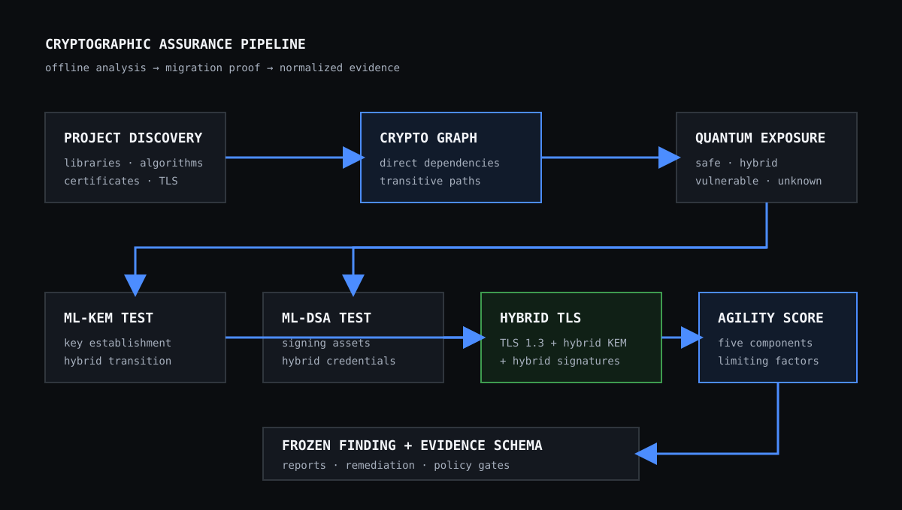
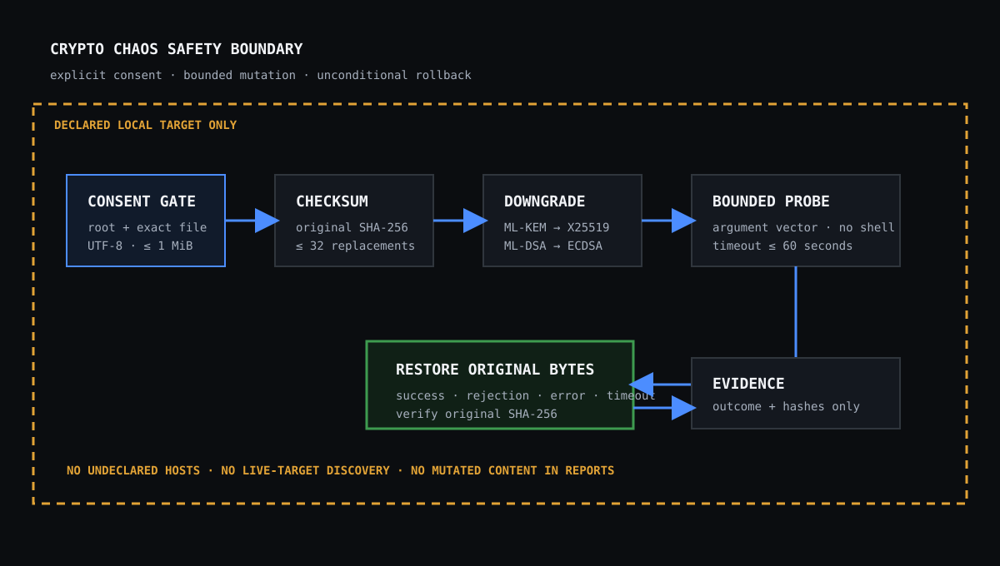

# Cryptographic assurance

Lattence v0.4 connects cryptographic inventory to migration and resilience
evidence. The workflow runs against files in a project checkout. Assessment is
offline. Chaos changes only an explicitly declared local configuration file,
runs a bounded local probe, and restores the original bytes before returning.



## Assessment model

Run the complete assessment with:

```bash
lattence pqc assess . --offline
```

The command writes `lattence-report.json` and `lattence-report.html` unless
`--out` selects another location. `--json` prints the structured assessment,
including the crypto graph, isolated vulnerable assets, traversable paths,
both migration tests, hybrid TLS validation, the agility score, downgrade
state, and normalized findings.

### Crypto dependency graph

The crypto graph is a deterministic projection of the security graph. It keeps:

- discovered algorithms and TLS configuration;
- certificates and their protection relationships;
- cryptographic dependency libraries;
- components that can reach a cryptographic asset; and
- source locations and relationship evidence.

An algorithm or certificate with no incoming crypto relationship is reported
as an isolated vulnerable asset. It is never called a path. A traversable path
contains at least two nodes and one relationship; direct and transitive paths
through applications, certificates, libraries, or other graph components are
reported separately. Cycles are bounded and output order is stable.

The report v1 schema remains version 1. Starting with v0.4.1, writers add the
optional summary fields `quantum_vulnerable_assets` and
`quantum_vulnerable_paths`; readers of older v1 documents default both to
zero. Structured assessment JSON replaces the ambiguous top-level
`vulnerable_paths` list with `quantum_exposure.isolated_assets` and
`quantum_exposure.paths`.

### Quantum-vulnerable dependencies

Classical public-key encryption, signature, and key-establishment algorithms
such as RSA, DSA, ECDSA, Ed25519, ECDH, and X25519 are classified as
quantum-vulnerable. ML-KEM, ML-DSA, and other recognized post-quantum
algorithms are safe. A construction that combines classical and post-quantum
algorithms is hybrid. Strong symmetric algorithms remain quantum-safe for this
inventory, while unmatched names remain unknown.

### ML-KEM migration test

The key-establishment test targets ML-KEM-768. It inventories discovered key
exchange, checks whether the target parameter set is present, identifies every
classical asset affected by migration, and returns one of four states:

- `already_migrated`: ML-KEM-768 is already configured;
- `hybrid_ready`: a classical-to-hybrid transition is available;
- `direct_ready`: the target is available for direct replacement; or
- `blocked`: key-exchange inventory or target support is missing.

### ML-DSA migration test

The signing test targets ML-DSA-65 and applies the same states to signature
algorithms and certificates. Hybrid readiness recommends dual classical and
ML-DSA credentials until every verifier accepts the post-quantum signature.

### Hybrid TLS validation

A valid hybrid TLS result requires all three of the following:

1. a discovered TLS 1.3 configuration;
2. classical plus post-quantum key exchange; and
3. classical plus post-quantum signatures.

An explicit hybrid algorithm satisfies its dimension. Separate safe and
vulnerable algorithms also satisfy it. Partial output lists each missing
requirement.

### Crypto agility score

The agility percentage is the integer mean of five visible components:

| Component | What it measures |
| --- | --- |
| Replaceability | Crypto assets have a source location or implementation boundary. |
| Configurability | Algorithm choices and TLS settings are explicit. |
| Dependency exposure | Fewer quantum-vulnerable target assets score higher. |
| Migration readiness | ML-KEM, ML-DSA, and hybrid TLS checks pass. |
| Downgrade resistance | Executed downgrade probes reject classical-only fallback. |

Every component below 100 names a limiting factor. An untested downgrade scores
zero rather than being treated as resistant.

## Crypto chaos and downgrade validation

Crypto chaos is an opt-in mutation workflow. Add both the project root and each
configuration file that may be changed to `lattence.targets.yaml`:

```yaml
version: "1"
authorization: owned-or-authorized
targets:
  - kind: project
    value: "."
  - kind: project
    value: "config/tls.conf"
```

Then run:

```bash
lattence crypto chaos . --offline
```

Rollback covers only the explicitly declared target files. JSON and HTML files
written beneath `--out` intentionally survive as the audit record of the
experiment; discovery excludes them from later assessments.

The current experiments replace a discovered ML-KEM or hybrid key-exchange
value with X25519 and replace a discovered ML-DSA or hybrid signature value with
ECDSA. A configuration can express an independent no-fallback control with
`require_pqc = true` or `require_pqc: true`. The probe reports `resistant` when
that control rejects both classical-only mutations and `vulnerable` when a
downgrade is accepted.



### Safety boundary

Before mutation, Lattence requires an exact project-relative declared path,
rejects symlinks that resolve outside the project, accepts UTF-8 text only,
limits the file to one mebibyte, limits a plan to 32 replacements, and records
the original SHA-256 digest. Probes use an argument vector without a shell and
have a maximum 60-second timeout. Original bytes are restored in a `finally`
path after success, rejection, launch error, or timeout, then verified against
the original digest.

Reports contain result metadata and digests, never the mutated file content.
Dry-run plans are available through the Python API and never write or launch a
probe. The CLI executes the declared local experiment; it does not discover or
mutate live network services.

### Findings and exit codes

Crypto results normalize into the existing version 1 `Finding` schema:

| Finding | Meaning |
| --- | --- |
| `LT-PQC-201` | ML-KEM migration is blocked. |
| `LT-PQC-202` | ML-DSA migration is blocked. |
| `LT-PQC-203` | Crypto agility has limiting factors. |
| `LT-PQC-204` | A downgrade was accepted. |
| `LT-PQC-205` | Downgrade validation is incomplete. |

Both commands honor `--fail-on`. Exit 0 means no finding meets the selected
threshold, exit 1 means at least one does, exit 2 is invalid usage or consent,
and exit 3 is an internal failure. Use `--fail-on none` to collect evidence
without failing a CI step.

## CI example

Assessment can gate a build without granting mutation consent:

```yaml
- name: Post-quantum assessment
  run: lattence pqc assess . --offline --json --fail-on high
```

Run crypto chaos only in an isolated checkout with the exact configuration
file declared. Because rollback is verified, a successful command leaves the
checkout byte-for-byte unchanged at each mutation target. A source-control
cleanliness check after the command remains a useful independent control.

## Current limits

- Migration checks validate discovered configuration and declared capability;
  they do not benchmark an ML-KEM or ML-DSA implementation.
- Hybrid TLS validation is static and does not connect to undeclared hosts.
- Crypto chaos operates on local text configuration, not live endpoints,
  hardware security modules, key stores, or production certificates.
- The reserved `--planner llm` mode remains unimplemented and fails clearly.
